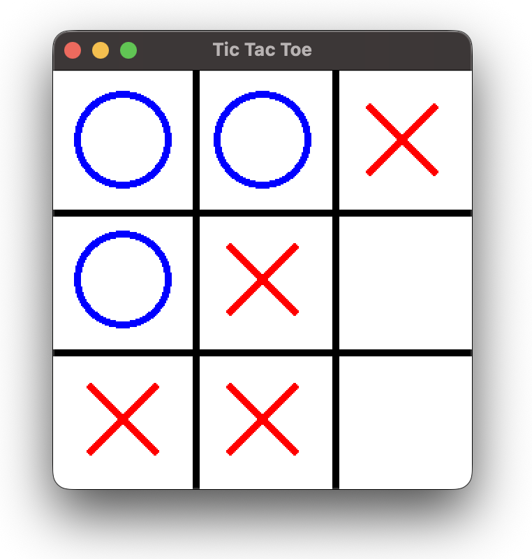

# TicTacToe - C++ Game

## Description

This project implements a TicTacToe game in C++ with several advanced features, including an artificial intelligence based on the Minimax algorithm with alpha-beta pruning, a variable grid size, and different game modes.

## Main Features

- **Three difficulty modes**:
  - Human vs Human
  - Easy (AI with random moves)
  - Hard (AI with Minimax algorithm)

- **Dynamic grid**: Grid size adapts based on results (3x3 to 6x6)
- **Multiple game sessions**: Ability to play several consecutive games
- **Console interface**: Clear display with cell numbering

## How It Works

### Game example

```bash
Welcome to Tic Tac Toe!

======================
How many players?
1. Two Players (Human vs Human)
2. One Player (vs Computer)

Enter your choice (1-2): 2

Select difficulty level:
1. Easy
2. Hard

Enter your choice (1-2): 2

How many games in a row? 1

Let's play! Opening game window...
````



### Game Flow

1. The board is displayed with empty cells numbered from 1 to n²
2. Player 'X' always starts first
3. Each player places their symbol in turn
4. The game ends with a win, loss, or tie
5. The system offers to continue with a new game

### Minimax Algorithm

The AI uses an optimal strategy based on exploring the possibility tree:

- Evaluates all possible moves up to a certain depth
- Uses alpha-beta pruning to optimize performance
- Scores: +10 (AI win), -10 (player win), 0 (tie)

## Project structure

```bash
TicTacToe
├─ CMakeLists.txt
├─ Makefile
├─ README.md
├─ include
│  ├─ Graphics.hpp
│  └─ TicTacToe.hpp
├─ src
│  ├─ Graphics.cpp
│  ├─ TicTacToe.cpp
│  └─ main.cpp
└─ tests
   └─ test_Graphics.cpp
   └─ test_TicTacToe.cpp
```

## Generate Doxygen documentation

At the root of the project

```bash
doxygen doxygenfile
```

Then to open the documentation

```bash
cd open documentation/html/index.html
```

## Compilation and Execution

This project uses a **Makefile** to automate the compilation process with `g++`.

Install [CMake](https://cmake.org/download/).

You will also need to install the **latest version** (v3) of [Catch2](https://catch2.org/#Installation) and the [SFML](https://www.sfml-dev.org/download/sfml/3.0.2/) library :

```bash
brew install sfml catch2 # MacOS
sudo apt install libsfml-dev catch2 # Ubuntu/Debian
```

To launch the game :

```bash
mkdir build
cd build
cmake ..
make
./PlayTicTacToe
```

To launch the tests :

```bash
cd build
./test_TicTacToe.cpp
./test_Graphics.cpp
```